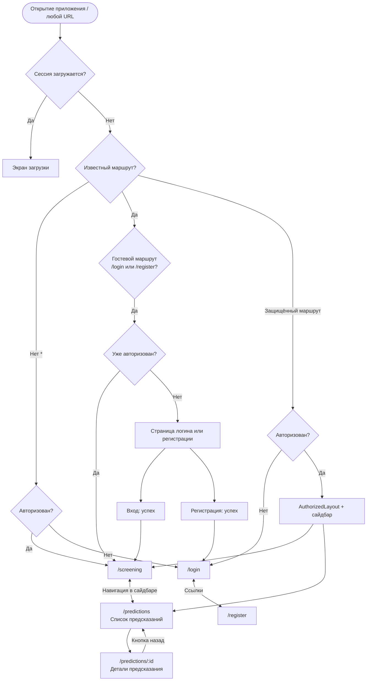

# User flow приложения

Диаграмма построена по роутингу (`src/app/App.tsx`), навигации (`AuthorizedLayout`) и формам авторизации.

## Краткая сводка

| Событие | Куда ведёт |
|--------|------------|
| Успешный вход | `/screening` |
| Успешная регистрация | `/login` |
| Защищённая страница без сессии | `/login` |
| Гость с сессией на `/login` или `/register` | `/screening` |
| Неизвестный URL | `/screening` или `/login` в зависимости от авторизации |
